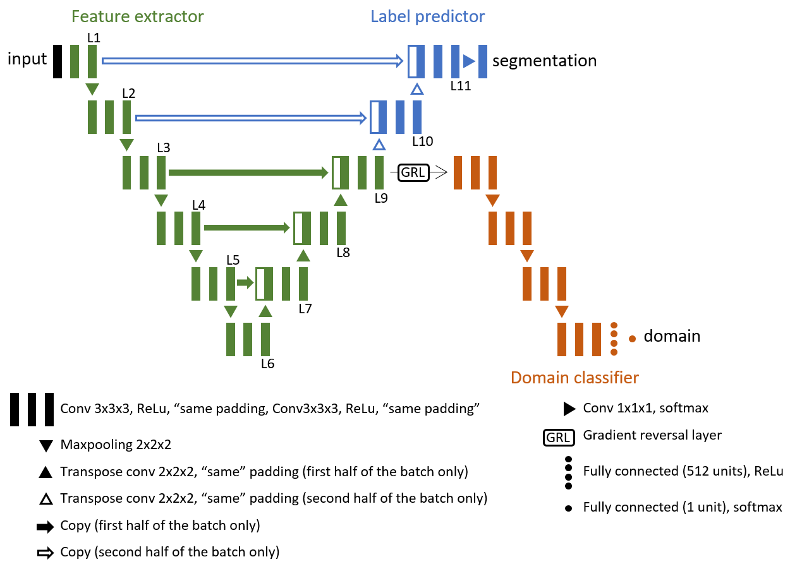

# unsupervised-domain-adaptation-unet-keras

In this repository, we encourages the learning of domain-invariant features (i.e., the same features are learned whether the input is from a source domain, like "CT", or target domain, such as "Cone Beam CT") through the use of a second network, the domain classifier, which interacts with the segmentation network in an adversarial fashion

Our proposed architecture unet\_L$x$ adapts u-net [1] to unsupervised domain adaptation by backpropagation [2] (unet_L9 is illustrated bellow). The goal is to learn from labeled CTs features that are also useful for segmenting images from a different yet similar domain (the CBCTs). U-net is split in two parts: a feature extractor and a label predictor. The feature extractor learns features from the whole batch (both CTs and CBCTs), with it's final layer L$x$ aiming to (i) be useful for the label predictor and (ii) fool the domain classifier. The label predictor learns feature from half the batch in the layer L$x$ (the CTs) aiming to predict a segmentation mask for these CTs. The domain classifier uses these same features L$x$ to classify all images in the batch (both CTs and CBCTs) as being either CTs or CBCTs.

# References
[1] Ronneberger, O., Fischer, P., & Brox, T. (2015, October). U-net: Convolutional networks for biomedical image segmentation. In International Conference on Medical image computing and computer-assisted intervention (pp. 234-241). Springer, Cham.

[2] Ganin, Y., & Lempitsky, V. (2014). Unsupervised domain adaptation by backpropagation. arXiv preprint arXiv:1409.7495.
